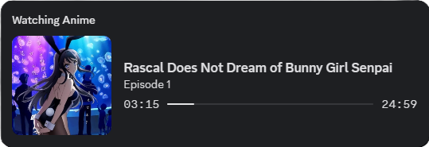

# Anime Discord RPC

    

Anime RPC is a browser extension and local Discord bridge that shows what you are currently watching in Discord Rich Presence.

The extension watches supported anime streaming pages, sends playback updates to a local WebSocket host, and the host publishes the activity to your Discord profile.

## Table of contents

- [What it does](#what-it-does)
- [Supported sites](#supported-sites)
- [Requirements](#requirements)
- [Installation](#installation)
    - [Firefox Add-ons](#firefox-add-ons)
    - [Chrome Extension](#chrome-extension)
- [Project structure](#project-structure)
- [License](#license)

## What it does

- Detects the current anime title, episode, and cover art.
- Tracks playback state such as watching, paused, or stopped.
- Updates Discord Rich Presence automatically through a local host process.

## Supported sites

- anikototv.to
- anikoto.cz
- aniwaves.ru
- animepahe.pw (and it's aliases)

## Requirements

- Discord desktop app installed and running.
- A supported Chromium-based browser or Firefox.
- Bun installed to run the local host manually.

## Installation

Pick the browser-specific install path below.

### Firefox Add-ons

Install the extension from the [Firefox Add-ons Store](https://addons.mozilla.org/en-US/firefox/addon/anikoto-discord-rpc/) and set up the host the same way as above:

1. Open the Firefox Add-ons Store and install the [Anime Discord RPC extension](https://addons.mozilla.org/en-US/firefox/addon/anikoto-discord-rpc/).
2. Download `host-x.x.x.zip` from the [latest releases page](https://github.com/minkxx/anime-discord-rpc/releases) and extract it to a folder on your computer.
3. Open a terminal in the extracted host folder and run `bun install`.
4. Open `host/start-rpc.vbs` and replace the `path_to_index.ts` path with the full path to your local `host/index.ts` file.
5. Copy `start-rpc.vbs` into your Windows Startup folder by pressing `Win + R`, typing `shell:startup`, and pasting the file there.
6. Double-click `start-rpc.vbs` to start the host, or restart your computer so Windows launches it automatically.

Once both the extension and host are running, open a supported anime site and Discord Rich Presence will update automatically.

### Chrome Extension

Download the Chrome package and set it up manually with the same host steps:

1. Download `host-x.x.x.zip` and `anime-rpc-x.x.x-chrome.zip` from the [latest releases page](https://github.com/minkxx/anime-discord-rpc/releases).
2. Extract `host-x.x.x.zip` to a folder on your computer.
3. Open a terminal in the extracted host folder and run `bun install`.
4. Open `host/start-rpc.vbs` and replace the `path_to_index.ts` path with the full path to your local `host/index.ts` file.
5. Copy `start-rpc.vbs` into your Windows Startup folder by pressing `Win + R`, typing `shell:startup`, and pasting the file there.
6. Double-click `start-rpc.vbs` to start the host, or restart your computer so Windows launches it automatically.
7. Extract `anime-rpc-x.x.x-chrome.zip` to a folder on your computer.
8. Open `chrome://extensions` in Chrome.
9. Enable Developer mode.
10. Click Load unpacked and select the extracted extension folder.

After both parts are set up, the extension will send playback updates to the local host and Discord Rich Presence will update automatically.

### Chrome Web Store

> [!WARNING]
> 
> Our extension is not available on the Chrome Web Store yet!

## Project structure

- extension/ contains the browser extension built with WXT.
- host/ contains the local Discord RPC bridge.

## License

[MIT License](/LICENSE)

Made with ❤️ by a weeb, for the weebs.
