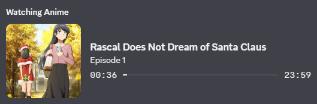

# Anime Discord RPC

    

**Show off the anime you're watching on your Discord profile!**

Ever wanted your Discord status to show exactly which anime and episode you are watching? This tool does exactly that! When you play, pause, or stop an anime on a supported website, your Discord status updates automatically.

---

## What You Need

* The **Discord desktop app** installed and running on your computer.
* **Google Chrome** or **Mozilla Firefox**.

## Supported Anime Sites

* hianime.at
* anikototv.to
* anikoto.cz
* aniwaves.ru
* animepahe.pw (and its other links)

---

## How to Set It Up

To make the magic happen, you need to install two things: the **Desktop App** and the **Browser Extension**.

### Step 1: Install the Desktop App

1. Go to our [Releases page](https://github.com/minkxx/anime-discord-rpc/releases).
2. Download the file named `anime-rpc-desktop-1.1.0.Setup.exe`.
3. Double-click the downloaded file to install it.
4. Open the app and let it run in the background!

### Step 2: Install the Browser Extension

**If you use Firefox:**
It's super easy! Just go to the [Firefox Add-ons Store](https://addons.mozilla.org/en-US/firefox/addon/anikoto-discord-rpc/) and click **"Add to Firefox"**.

**If you use Chrome:**
We aren't in the Chrome Web Store just yet, so follow these simple steps:

1. Go to the [Releases page](https://github.com/minkxx/anime-discord-rpc/releases) and download `anime-rpc-extension-1.4.1-chrome.zip`.
2. **Extract (unzip)** that file into a regular folder on your computer.
3. Open Google Chrome and type `chrome://extensions` into the top web address bar and press Enter.
4. Look at the top-right corner of the screen and turn **ON** the switch for **Developer mode**.
5. Click the **Load unpacked** button that appears on the top left.
6. Select the folder you just unzipped. You're done!

*That's it! Open one of the supported anime websites, start an episode, and check your Discord profile!*

---

## Helping Out

Contributions are always welcome! If you want to add a new anime site or fix a bug, please read our [Contributing Guidelines](/CONTRIBUTING.md) to learn how to set up the project and open a Pull Request.

## 📜 License

[MIT License](/LICENSE)

Made with ❤️ by Minkxx

